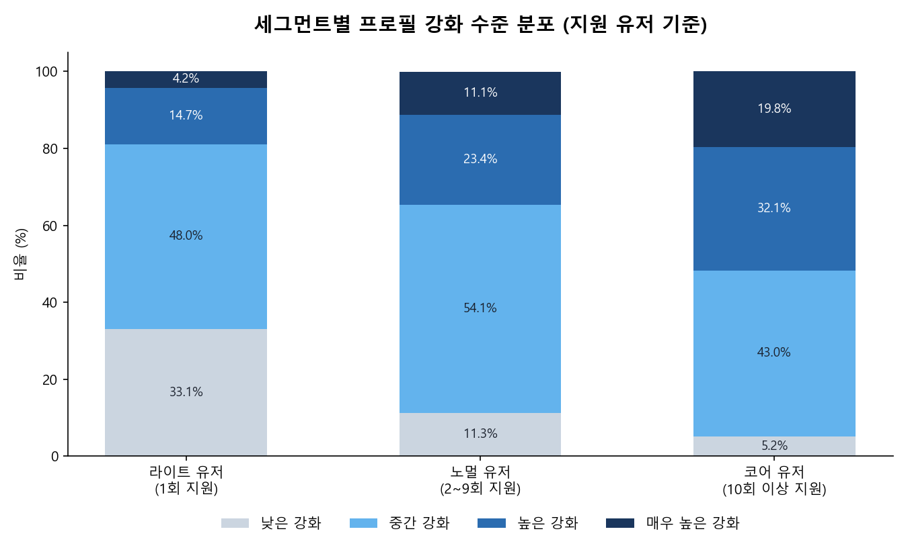

# 채용 플랫폼 유저 행동 분석

채용 플랫폼의 서버 로그(2022-01-01 ~ 2023-12-31)를 바탕으로, "어떤 행동이 좋은 유저를 만드는가"와 "좋은 유저는 어떤 경로로 서비스에 정착하는가"를 분석한 프로젝트다. 가입(Acquisition) → 활동(Activation) → 재방문(Retention)의 AAR 흐름을 따라가면서, 후반부에는 지원 횟수를 기준으로 유저를 세그먼트화해 "무엇이 유저를 반복 지원자로 성장시키는가"까지 규명한다.

## 핵심 결론

지원 횟수 기준으로 유저를 라이트(1회) · 노멀(2~9회) · 코어(10회 이상)로 나눠 보면, 세그먼트가 올라갈수록 프로필 조회율·구축 행동·강화 수준이 모두 같은 순서로 계단식으로 증가한다. 그리고 세 세그먼트 모두 프로필을 다듬는 행동은 지원 **후**보다 지원 **전**에 더 많이 일어난다 — 즉 "지원하고 나서 프로필을 정리한다"가 아니라 **"프로필을 먼저 정비한 뒤 지원에 나서고, 그 결과로 더 많이, 더 깊이 지원을 이어간다"**는 것이 이 프로젝트의 결론이다.



가입 직후 온보딩에서 프로필(특히 포트폴리오·경력검증) 완성을 유도하는 것이 다회 지원자·코어 유저를 늘리는 가장 직접적인 레버로 보이며, 이 상관관계를 실제 인과관계로 검증하기 위한 A/B 테스트 설계안도 함께 마련했다.

## 보고서

| 문서 | 내용 |
|---|---|
| [00_Main_Report](reports/00_Main_Report.pdf) | **종합 보고서** — 프로젝트 전체 흐름과 유저 세그먼트 분석 결론 |
| [01_Acquisition_Report](reports/01_Acquisition_Report.pdf) | 가입 퍼널·유입 경로·가입 소요시간 |
| [02_Activation_Report](reports/02_Activation_Report.pdf) | 가입 후 검색·지원·북마크 활동 |
| [03_Retention_Report](reports/03_Retention_Report.pdf) | URL 로그 기반 리텐션 지표 계산 |
| [04_MultiApply_Segment_Analysis](reports/04_MultiApply_Segment_Analysis.pdf) | 지원 횟수별 세그먼트 특성 사전 탐색 |
| [05_CoreUser_Report](reports/05_CoreUser_Report.pdf) | 01~04 통합 + 회사 탐색·오퍼·프로필 강화 분석 |
| [AB_Test_Plan](reports/AB_Test_Plan.pdf) | 프로필 강화 온보딩 넛지의 인과 효과를 검증하는 A/B 테스트 설계안 |

각 보고서는 해당 노트북을 실제로 실행해서 나온 차트를 담고 있다(요약 텍스트가 아니라 실제 렌더링된 그래프). PDF가 기본 산출물이고, 수정 가능한 원본(Markdown·HTML·차트 이미지)은 `reports/source/`에 있다.

## 폴더 구조

```
recruit/
├── notebooks/                          분석 노트북 5개
│   ├── 01_Acquisition_Report.ipynb        가입 퍼널 / 유입 경로 / 가입 소요시간
│   ├── 02_Activation_Report.ipynb         검색·지원·북마크 활동 분석
│   ├── 03_Retention_Report.ipynb          URL 기반 리텐션 분석
│   ├── 04_MultiApply_Segment_Analysis.ipynb  지원횟수별 지원기업수·북마크·다양성 비율
│   ├── 05_CoreUser_Report.ipynb           01~04 + 프로필 강화 행동을 종합한 최종 리포트
│   └── _cache/                          위 5개가 쓰는 로컬 캐시 (저장소에서 제외됨)
│       └── README.md                    캐시 동작 방식·재생성 방법
│
├── reports/                 보고서 PDF 7개 (종합 1 + 노트북별 5 + A/B 설계안 1)
│   ├── 00_Main_Report.pdf / 01~05_*.pdf / AB_Test_Plan.pdf
│   └── source/               위 보고서들의 원본 Markdown·HTML·차트 이미지(assets/00~05)
│
├── outputs/                 대시보드·분석 산출물
│   ├── cohort_search_summary.pdf        세그먼트별 검색어 특징 요약
│   └── (집계 CSV)                       대시보드용 집계 결과 — 로컬 전용, 저장소에서 제외됨
│
├── archive_raw/             원본 DB 덤프 보관 위치 — 로컬 전용, 저장소에서 제외됨
│                            (노트북 어디에서도 참조하지 않는다)
│
├── .env.example              DB 접속 정보 템플릿 (실제 값이 든 .env 는 저장소에서 제외됨)
├── requirements.txt          venv 재현용 패키지 목록
└── .venv/                    가상환경
```

## 실행 방법

1. **접속 정보 설정.** 저장소 루트의 `.env.example`을 `.env`로 복사하고 실제 값을 채운다. `.env`는 `.gitignore`로 제외되어 있어 커밋되지 않는다.

   ```bash
   cp .env.example .env
   ```

   복사한 `.env`의 `RECRUIT_DB_URL`에 접속 문자열을 채운다. 형식은 다음과 같다.

   ```
   RECRUIT_DB_URL=mysql+pymysql://<user>:<password>@localhost:3306/<database>?charset=utf8mb4
   ```

   노트북의 DB 연결 셀이 `python-dotenv`로 이 파일을 자동으로 읽는다(`pip install -r requirements.txt`에 포함). 하위 폴더에서 실행해도 루트까지 거슬러 올라가 찾는다. `.env` 대신 셸 환경변수로 `RECRUIT_DB_URL`을 직접 내보내도 동작한다.
2. `.venv`를 활성화한 뒤 `notebooks/` 폴더를 기준 디렉터리로 열어서 실행한다(모든 상대경로가 `notebooks/` 기준이고, 캐시는 `_cache/` 밑에 있다). Jupyter 커널은 `.venv` 인터프리터(커널스펙 이름 `recruit`)를 선택.
3. **캐시만으로 재현되는 건 04뿐이고, 나머지 넷은 로컬 MySQL이 켜져 있어야 한다.** 캐시(`REFRESH = False`)가 걷어내는 것은 무거운 쿼리 일부일 뿐, 대부분의 셀은 매번 DB를 직접 조회한다.

   | 노트북 | 캐시 경유 | DB 직접 조회 | DB 없이 실행 |
   |---|---|---|---|
   | 01 | 3셀 | 17셀 | 불가 |
   | 02 | 2셀 | 12셀 | 불가 |
   | 03 | 0셀 | 1셀(대용량) | 불가 |
   | 04 | 2셀 | 0셀 | **가능** |
   | 05 | 2셀 | 8셀 | 불가 |

4. 03은 리텐션 원본 쿼리를 캐시하지 않아 매번 수백만 행을 새로 조회한다 — 실행에 10분 이상 걸릴 수 있다.
5. 노트북에 저장된 출력은 **차트와 `print`로 찍은 요약 수치**뿐이다. 데이터프레임 표는 저장하지 않으므로, 표 형태로 보려면 각자 실행해야 한다.

## 데이터 취급

이 저장소에는 제공받은 원본 데이터가 포함되어 있지 않다. 계약상 원본 데이터의 복제·배포·공개가 금지되어 있어 다음 원칙을 따른다.

- 원본 DB 덤프·캐시(`.sql` / `.pkl` / `.parquet`)는 물론 CSV 전체를 `.gitignore`로 제외하고, `archive_raw/` · `_cache/` · `dashboard_source/` 는 폴더째 제외한다.
- 노트북에 저장하는 출력은 차트와 요약 수치뿐이다. 데이터프레임 표 출력은 저장하지 않고, 원본 행을 띄우던 미리보기는 주석 처리했으며, 스키마를 노출하는 `SHOW TABLES` / `.info()` 셀은 제거했다.
- 차트도 값이 통째로 실리지 않게 한다. `plotly` 히스토그램은 구간 계산을 브라우저에서 하느라 유저별 원본 값이 파일에 저장되므로, 미리 집계한 뒤 막대로 그린다(`05` 7.2-1절).
- DB 접속 정보는 코드에 두지 않는다. 로컬 `.env`(제외 대상)에 두고 `python-dotenv`로 읽으며, 저장소에는 값이 빈 `.env.example`만 포함한다.
- 공유 대상은 분석 과정과 결론(보고서 PDF, 집계 차트)까지이며, 원본 데이터를 유추하거나 복원할 수 있는 자료는 공유하지 않는다.

## 참고

- `04_MultiApply_Segment_Analysis.ipynb`는 원본 자료의 일부 섹션("사용자행동 비교", "회사탐색 이상치")이 빠져 있다 — 정의되지 않은 데이터프레임을 참조하는 코드라 애초에 실행이 불가능했기 때문이다.
- 01·03·04는 `## N.` / `### N-M.` / `#### 해석` 형식의 목차를 따른다. 02는 일부 절에서 `####`·`#####`를 섞어 쓰고, 05는 `# N.` / `## N.M` 형식을 따로 쓴다 — 05가 01~04를 통합한 최종 리포트라 별도 체계로 정리된 결과다.
- `outputs/`의 집계 CSV들은 `05_CoreUser_Report.ipynb`의 프로필 강화 분석(11절) 로직과 수치가 일치하지만, 그 산출물을 만들었던 코드 자체는 지금 노트북에 남아있지 않다. `00_Main_Report`의 세그먼트 차트는 이 집계 수치로 직접 그린 것이다.
