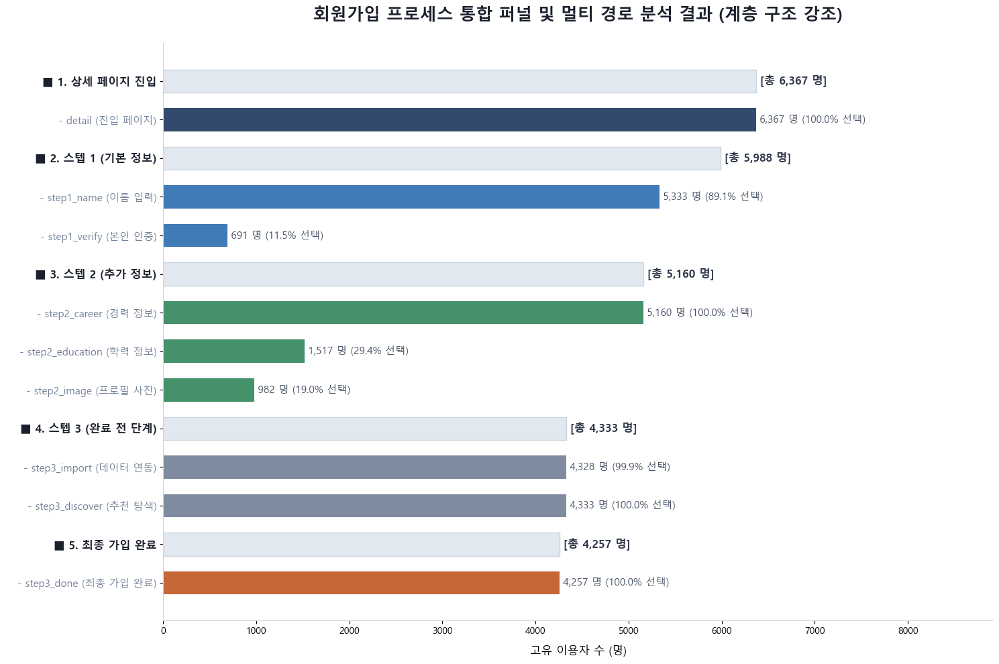
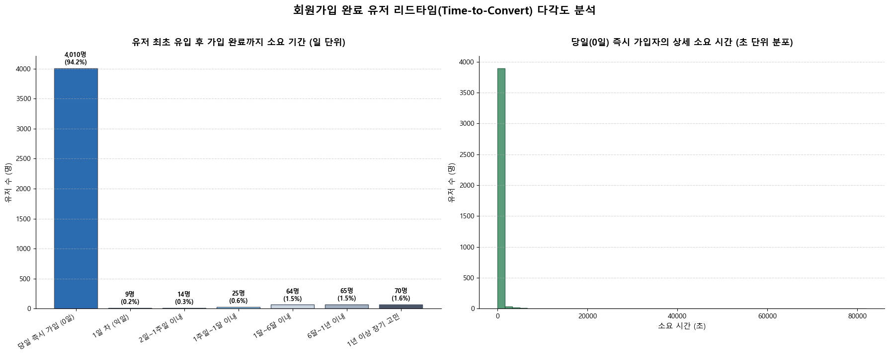
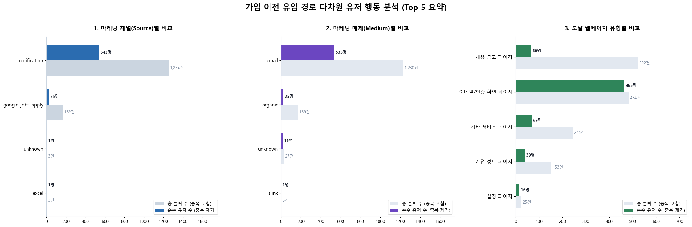
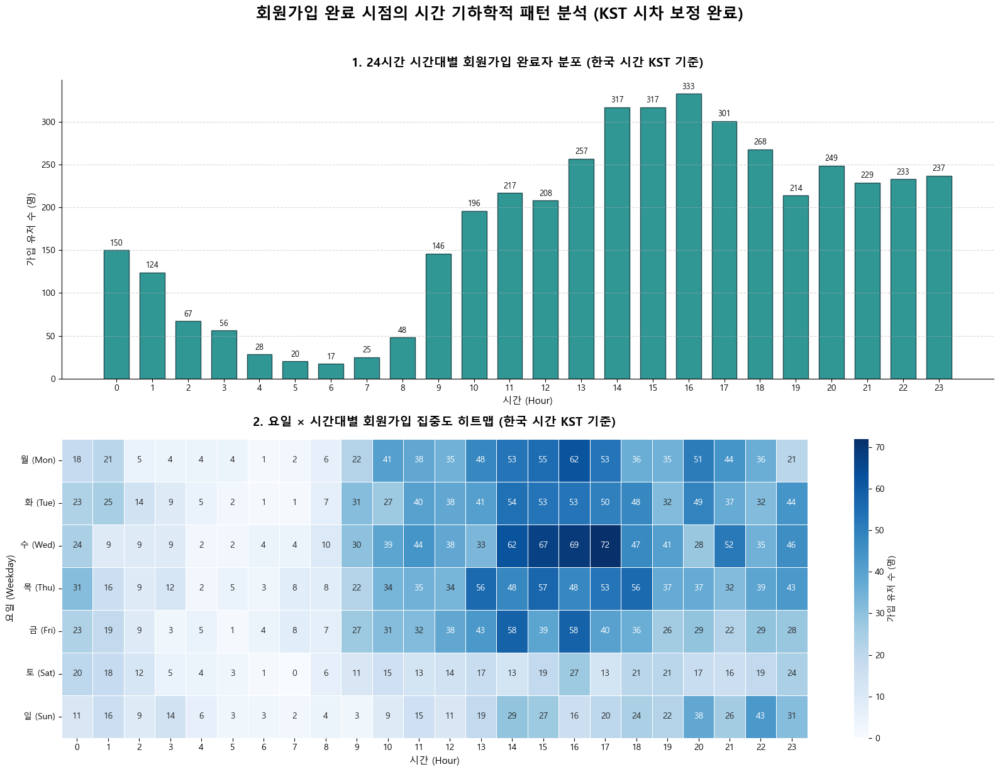
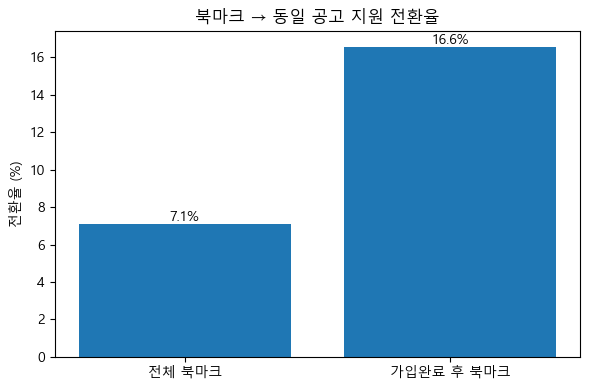

# Acquisition 분석 보고서

원본: `notebooks/01_Acquisition_Report.ipynb` · 분석 기간 2022-01-01 ~ 2023-12-31

채용 플랫폼에 처음 유입된 사용자가 회원가입을 완료하기까지의 과정을 가입 퍼널·소요 시간·유입 경로·시계열·북마크 행동 5개 축으로 분석했다.

## 1. 가입 퍼널과 소요 시간

detail(상세 페이지 진입) → step1(기본 정보) → step2(추가 정보) → step3/done(완료) 순으로 진행되는 가입 퍼널을 세부 단계까지 쪼개면, 각 단계 안에서도 선택적으로 건너뛰는 항목이 뚜렷하게 보인다.

<figure>

<figcaption><b>그림 1.</b> 회원가입 프로세스 통합 퍼널 — 상위 단계(연한 회색 막대)와 그 안의 세부 행동(색상 막대)을 함께 표시. 상세 페이지 진입 6,367명 중 최종 가입 완료(step3_done)까지 도달한 인원은 4,257명(66.9%)이다.</figcaption>
</figure>

- **본인 인증이 최대 병목**: step1 안에서 이름 입력(89.1%)에 비해 본인 인증(11.5%)을 거치는 비율이 크게 낮다 — step1 내부에서 가장 많이 이탈하는 항목.
- **학력·프로필 사진은 선택 사항으로 취급됨**: step2에서 경력 정보(100%)는 전원이 거치지만 학력 정보(29.4%)·프로필 사진(19.0%)은 소수만 입력한다.
- **step3는 사실상 필수 관문**: step3_import(99.9%)·step3_discover(100%) 모두 포화 상태로, 이 단계 자체는 이탈 요인이 아니다.

가입에 걸리는 시간은 극단적으로 양극화되어 있다.

<figure>

<figcaption><b>그림 2.</b> 좌: 최초 서비스 유입 ~ 가입 완료까지 소요 기간 구간별 분포. 우: 당일(0일) 즉시 가입자의 초 단위 상세 분포.</figcaption>
</figure>

- 가입 완료 유저의 **중앙값 소요 시간은 2분 16초**로, 대부분 온보딩에 진입하자마자 바로 완료한다.
- 반면 **평균은 3.1일**까지 늘어나는데, 이는 최대 671일에 달하는 극단적 이상치 소수가 평균을 끌어올린 결과다 — 즉 "대부분은 즉시 가입, 일부만 오래 고민 후 재방문 가입"하는 이중 구조다.

## 2. 유입 경로

가입 완료 유저가 가입 직전 어떤 채널·매체·페이지를 거쳤는지(UTM 파라미터 기준) 살펴보면, 자체 CRM이 압도적인 비중을 차지한다.

<figure>

<figcaption><b>그림 3.</b> 가입 이전 유입 경로 Top 5 비교 — 연한 막대는 총 클릭 수(중복 포함), 진한 막대는 순수 유저 수(중복 제거). 왼쪽부터 마케팅 채널(Source) · 매체(Medium) · 도달 웹페이지 유형.</figcaption>
</figure>

- **CRM 알림·이메일이 핵심 채널**: 채널 기준 `notification`(542명), 매체 기준 `email`(535명)이 압도적 1위이며 외부 광고(`google_jobs_apply`, 25명) 대비 20배 이상이다.
- **유저당 평균 2.3회 클릭 후 가입**: 이메일을 열어본 뒤 곧바로 가입하지 않고 일정 기간 반복 노출된 뒤 전환되는 경향이 있다.
- **두 갈래의 유입 목적**: '이메일/인증 확인 페이지'는 유저당 클릭이 1회에 수렴(465명/484건)해 목적이 분명한 반면, '채용 공고 페이지'는 66명이 522건을 조회해 유저당 약 8회씩 반복 탐색한다 — 매력적인 공고가 가입을 유도하는 미끼 역할을 한다.

## 3. 가입 타이밍 패턴과 북마크 행동

가입은 특정 요일·시간대에 뚜렷하게 몰린다.

<figure>

<figcaption><b>그림 4.</b> 상: 24시간 시간대별(KST) 가입 완료자 분포. 하: 요일 × 시간대 히트맵 — 색이 진할수록 가입 집중도가 높음.</figcaption>
</figure>

- **평일·주간 시간대 집중**: 새벽(4~7시)에는 가입이 거의 없고 오후 14~17시에 피크(각 300명 이상)를 이룬다.
- **수요일이 정점**: 히트맵에서 수요일 오후 4시(72명)가 전체 요일·시간대 조합 중 가장 진하며, 수요일 오후 2~5시 구간 전체가 다른 요일보다 뚜렷하게 높다.
- **주말은 완만하지만 존재**: 토·일요일은 평일보다 낮지만 0으로 떨어지지 않고 고르게 분포한다.

북마크 행동은 가입 전환과 뚜렷한 상관관계를 보인다.

<figure>

<figcaption><b>그림 5.</b> 전체 북마크 대비, 가입 완료 후에 한 북마크의 동일 공고 지원 전환율 비교.</figcaption>
</figure>

- 가입 단계가 진행되는 도중에는 북마크가 거의 발생하지 않는다 — 북마크는 가입 전(탐색) 또는 가입 후(본격 활동) 둘 중 하나에 몰린다.
- **가입 완료 후 북마크는 지원 전환율이 전체 평균 대비 2.3배 높다** — 로그인 상태에서 저장한 공고일수록 실제 지원까지 이어질 확률이 크게 높아진다.
- 가입 전 북마크된 공고는 SW개발 직무 비중이 가장 높지만, 북마크 자체가 가입을 유도하는 주요 요인은 아니다(2절의 CRM·공고 반복 조회가 더 직접적인 유인).

## 결론 및 제언

| 제안 액션 | 관찰된 근거 |
|---|---|
| CRM 이메일 UI·개인화 추천 고도화 | 가입 전환의 최대 채널, 유저당 평균 2.3회 반복 클릭 후 가입 (그림 3) |
| step1 본인 인증 단계 UX 개선 | step1 내 이탈이 가장 큰 세부 구간, 89.1%→11.5% 급감 (그림 1) |
| 수요일 오후 2~4시 타겟 발송 | 요일·시간대별 가입 집중도가 가장 높은 구간 (그림 4) |
| 비회원 공고 조회 시 가입 유도 요소 배치 | 채용 공고 반복 조회 후 가입하는 탐색형 유입 존재 (그림 3) |
| 가입 후 북마크 유도 넛지 강화 | 가입 후 북마크의 지원 전환율이 2.3배 높음 (그림 5) |

우선순위(실행 순서)는 팀 리소스·기술 난이도 등 이 분석 밖의 정보에 달려 있어 별도로 매기지 않았다. 위 액션들은 모두 노트북에서 실제로 관찰된 수치를 근거로 한다.
