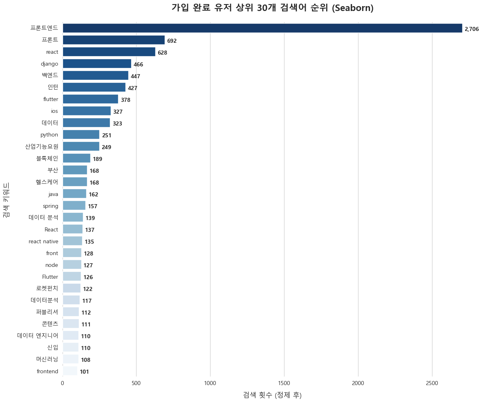
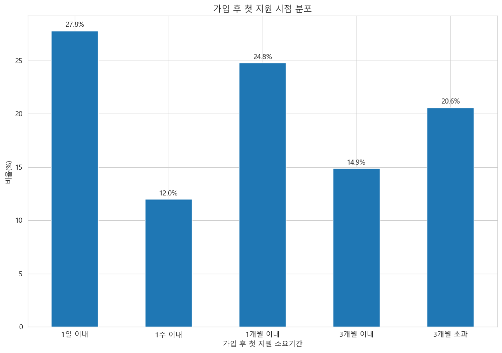
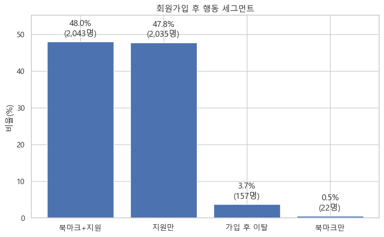
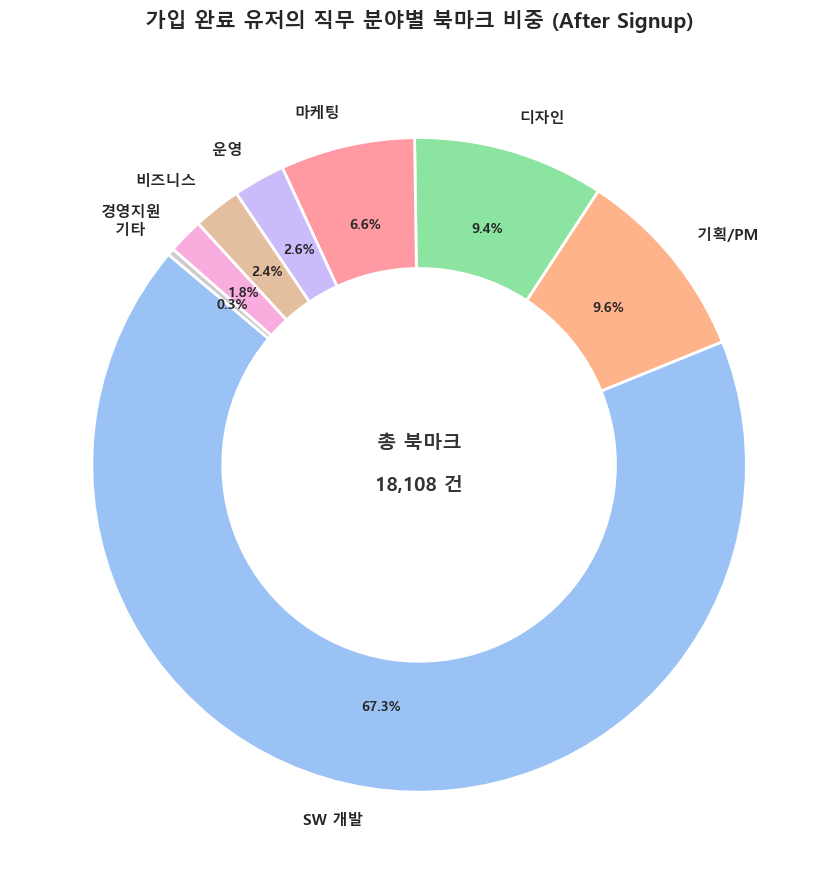
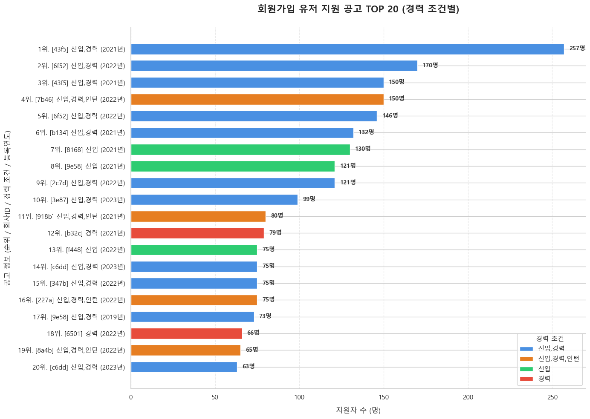
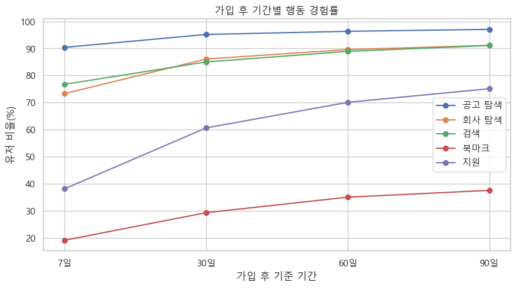

# Activation 분석 보고서

원본: `notebooks/02_Activation_Report.ipynb` · 분석 대상: 가입 완료(`step3/done`, 200) 유저 · 분석 기간 2022-01-01 ~ 2023-12-31

가입을 마친 유저가 실제로 검색·지원·북마크 같은 핵심 기능을 어떻게 쓰기 시작하는지, 그리고 그 활동이 시간이 지나며 어떻게 깊어지는지를 분석했다.

## 1. 검색 행동과 첫 지원까지의 여정

가입 완료 유저의 검색어를 집계하면 특정 직군에 대한 쏠림이 뚜렷하다.

<figure>

<figcaption><b>그림 1.</b> 가입 완료 유저의 상위 30개 검색어(정제 후 검색 횟수 기준). '프론트엔드'가 2,706회로 2위 '프론트'(692회)의 4배 가까이 앞선다.</figcaption>
</figure>

- **프론트엔드 개발 직군에 압도적으로 쏠려 있다**: 상위 검색어 대부분이 개발 직군(프론트엔드/react/django/백엔드/flutter/ios/python) 관련이며, '데이터'·'헬스케어'·'블록체인' 등이 그 뒤를 잇는다.
- 가입 완료 후 첫 행동은 **프로필편집(1,520명) → 공고조회(1,382명) → 검색(579명)** 순으로 많다 — 검색보다 프로필 정비나 공고 확인이 더 이른 행동이다.

가입 후 첫 지원까지 걸리는 시간은 넓게 퍼져 있다.

<figure>

<figcaption><b>그림 2.</b> 가입 완료 후 첫 지원까지 걸린 기간 구간별 비율.</figcaption>
</figure>

- **1일 이내 즉시 지원이 27.8%**로 가장 큰 단일 구간이다 — 가입 전에 이미 지원할 공고를 정해둔 유저층으로 보인다.
- 반면 **20.6%는 3개월이 지나서야 첫 지원**을 한다. 중앙값은 13.3일(약 2주)이지만 평균은 62.2일(약 2개월)까지 늘어나, 이력서 보관용 가입이나 휴면 후 재방문 같은 지연 패턴이 섞여 있음을 시사한다.

## 2. 첫 행동이 만드는 차이, 그리고 북마크의 역할

가입 직후 첫 행동으로 무엇을 했는지가 이후 지원 활동의 크기를 가른다.

<figure>

<figcaption><b>그림 3.</b> 가입 완료 유저를 가입 이후 행동 기준으로 4개 세그먼트로 분류. 북마크+지원(48.0%)과 지원만(47.8%)이 대부분을 차지한다.</figcaption>
</figure>

- **북마크만 하고 지원하지 않는 유저는 0.5%(22명)에 불과**하다 — 북마크는 지원을 대체하는 기능이 아니라 지원으로 이어지는 보조 행동이다.
- **가입 후 완전히 이탈하는 비율도 3.7%로 매우 낮다** — 가입 퍼널을 통과한 유저 대부분은 어떤 형태로든 실제 구직 활동을 시작한다.
- 첫 행동으로 프로필을 먼저 편집한 유저의 평균 지원 횟수(8.16회)는 공고를 먼저 조회한 유저(5.49회)보다 뚜렷이 높다(중앙값 4회 vs 2회) — 프로필 정비가 이후 적극적인 구직 활동의 선행 지표로 보인다.

북마크된 공고의 직무 분야를 보면 검색 행동과 같은 쏠림이 나타난다.

<figure>

<figcaption><b>그림 4.</b> 가입 후 북마크된 공고(총 18,108건)의 직무 분야별 비중. SW개발이 67.3%로 압도적이다.</figcaption>
</figure>

## 3. 인기 공고 특성과 시간에 따른 활동 성장

실제로 가장 많은 지원을 받은 공고를 보면, 검색·북마크에서 드러난 SW개발 쏠림이 지원 단계까지 이어진다.

<figure>

<figcaption><b>그림 5.</b> 가입 완료 유저의 지원 공고 TOP 20 (경력 조건별 색상). 1위 공고는 257명이 지원했다.</figcaption>
</figure>

- TOP 20 중 다수가 '신입,경력' 또는 '신입' 조건으로, 경력 무관·신입 허용 공고에 지원이 집중된다.
- 종합적으로 지원 집중도에 영향을 미치는 순서는 **직무 > 경력 조건 > 연봉 공개 여부 > 원격근무 여부**이며(노트북 4-2절), 연봉 공개 공고가 비공개 대비 약 8% 높은 평균 지원자 수를 보인다.

가입 후 시간이 지날수록 각 행동의 경험률은 함께 증가하지만, 그 속도는 행동마다 다르다.

<figure>

<figcaption><b>그림 6.</b> 가입 후 7·30·60·90일 기준 행동 경험률 추이.</figcaption>
</figure>

- **공고 탐색(90.5%→97.4%)·회사 탐색·검색은 가입 7일 만에 이미 70% 이상**에 도달해 빠르게 포화한다.
- 반면 **지원(38.4%→75.2%)과 북마크(19.2%→37.8%)는 완만하게 계속 증가**한다 — 탐색은 초반에 몰리지만, 실제 지원·저장 행동은 90일 동안 꾸준히 쌓이는 후행 지표다.

## 결론 및 제언

| 제안 액션 | 관찰된 근거 |
|---|---|
| 가입 직후 프로필 작성 온보딩 넛지 강화 | 프로필을 먼저 편집한 유저의 평균 지원 횟수가 1.5배 높음 (그림 3) |
| 가입 후 1~2주 시점 재방문 유도 알림 | 첫 지원까지 중앙값 13.3일, 3개월 초과 지연도 20.6% 존재 (그림 2) |
| SW개발·신입 가능·연봉 공개 공고 노출 강화 | 검색·북마크·지원 전 단계에서 SW개발 쏠림이 일관되게 관찰됨 (그림 1, 4, 5) |
| 가입 후 30일 이후에도 지원·북마크 유도 지속 | 두 지표는 90일까지 완만히 계속 증가하는 후행 지표 (그림 6) |

우선순위(실행 순서)는 팀 리소스·기술 난이도 등 이 분석 밖의 정보에 달려 있어 별도로 매기지 않았다. 위 액션들은 모두 노트북에서 실제로 관찰된 수치를 근거로 한다.
