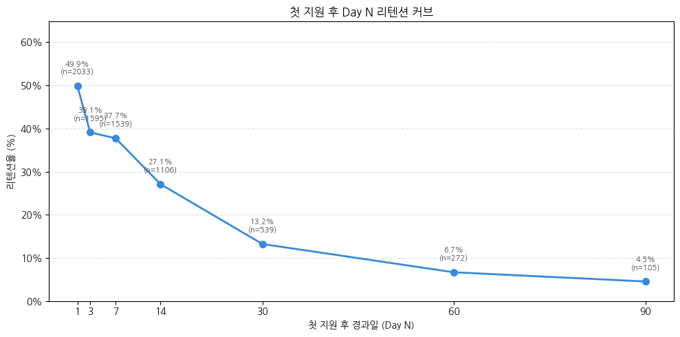
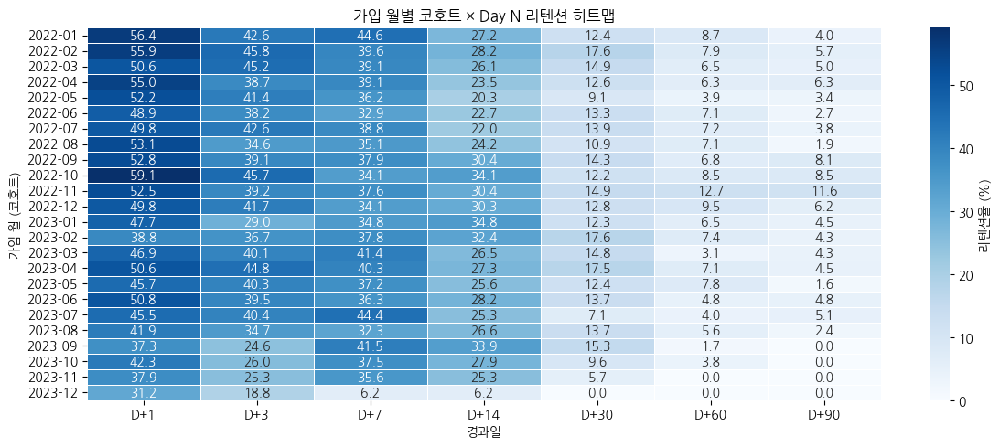
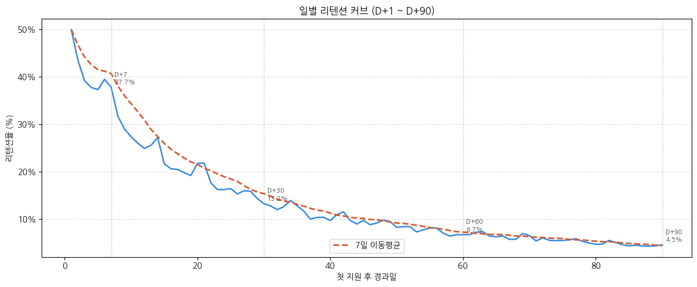
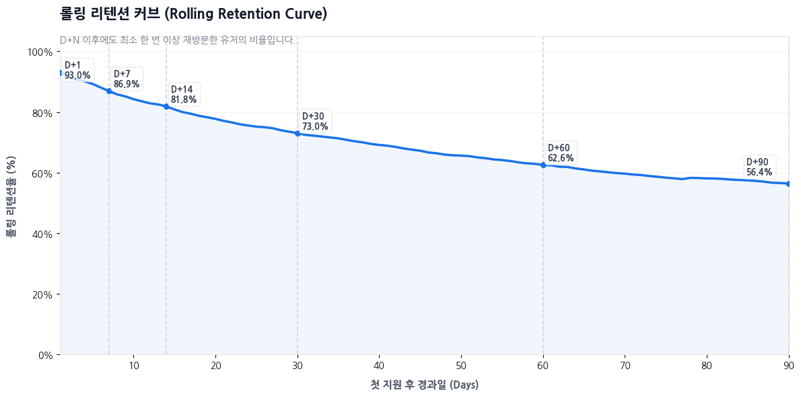

# Retention 분석 보고서

원본: `notebooks/03_Retention_Report.ipynb` · 분석 기간 2022-01-01 ~ 2023-12-31

가입 완료 후 첫 지원까지 마친 유저를 대상으로, URL 로그 기반 리텐션(재방문) 지표를 계산한다. 이 노트북은 지표 계산 파이프라인 성격이 강하고, 수치에 대한 비즈니스 해석은 대부분 `05_CoreUser_Report.ipynb`로 넘어간다. 여기서는 계산된 4개 핵심 지표를 차트로 정리한다.

**리텐션 기준**: 첫 지원 시점으로부터 24시간 이후, 이용률 상위 30% URL을 재방문한 경우를 "리텐션됨"으로 정의한다.

## 1. Day N 리텐션 커브

첫 지원 후 D+1부터 D+90까지 정해진 시점에 재방문했는지를 측정한 지표다.

<figure>

<figcaption><b>그림 1.</b> 첫 지원 후 경과일(Day N)별 리텐션율. D+1 49.9% → D+7 37.7% → D+30 13.2% → D+90 4.5%.</figcaption>
</figure>

- 전형적인 리텐션 커브 형태로, **초반에 급격히 감소한 뒤 완만해진다**.
- D+1(49.9%)에서 D+7(37.7%)까지 12%p 이상 빠지고, D+30 이후로는 감소 폭이 눈에 띄게 줄어든다.

## 2. 코호트별 리텐션 히트맵

가입 월별로 유저를 코호트로 묶어 Day N 리텐션을 비교하면, 시기에 따른 편차를 볼 수 있다.

<figure>

<figcaption><b>그림 2.</b> 가입 월(행) × 경과일(열) 기준 리텐션율(%) 히트맵. 색이 진할수록 리텐션율이 높음.</figcaption>
</figure>

- D+1 리텐션율은 2022년 초반 코호트(1~2월, 55% 이상)가 2023년 후반 코호트보다 대체로 높다.
- 2023년 9~12월 코호트는 관측 가능한 최대 경과일이 짧아(데이터가 2023-12-31까지) D+60·D+90 값이 0 또는 결측에 가깝다 — 절대 비교보다는 D+1~D+14 구간 위주로 해석해야 한다.

## 3. 일별 리텐션과 롤링 리텐션의 차이

같은 리텐션 데이터를 "그 날 정확히 재방문했는가"(일별)와 "그 날 이후 한 번이라도 재방문했는가"(롤링)로 다르게 집계하면 곡선의 모양이 크게 달라진다.

<figure>

<figcaption><b>그림 3.</b> 일별(Classic) 리텐션 커브와 7일 이동평균. 특정 날짜에 정확히 재방문한 유저 비율.</figcaption>
</figure>

<figure>

<figcaption><b>그림 4.</b> 롤링(Rolling) 리텐션 커브 — D+N 이후 최소 한 번 이상 재방문한 누적 비율. D+1 93.0% → D+30 73.0% → D+90 56.4%.</figcaption>
</figure>

- **일별 리텐션은 0에 가깝게 빠르게 수렴**하는 반면(D+90 4.5%), **롤링 리텐션은 훨씬 완만하게 감소**한다(D+90 56.4%) — 같은 유저 집단이라도 "그날 딱 재방문했는가"와 "그날 이후 언제든 재방문했는가"는 전혀 다른 그림을 보여준다.
- 이 차이 자체가 두 지표의 정의 차이에서 나오는 것이므로, 어느 쪽이 "진짜" 리텐션인지는 지표 정의에 달려 있다 — 재참여 빈도를 보려면 일별, 이탈 여부를 보려면 롤링이 더 적합하다.

## 결론 및 다음 단계

이 노트북 자체는 정의·전처리·지표 계산에 집중되어 있어 별도의 비즈니스 제언을 담고 있지 않다. 위 4개 지표에 대한 실제 수치 해석과 종합 인사이트(예: Day 7~14 구간이 장기 재방문 여부를 가르는 분기점이라는 결론)는 `05_CoreUser_Report.ipynb`의 "6. Retention 분석" 절에서 이어진다.
