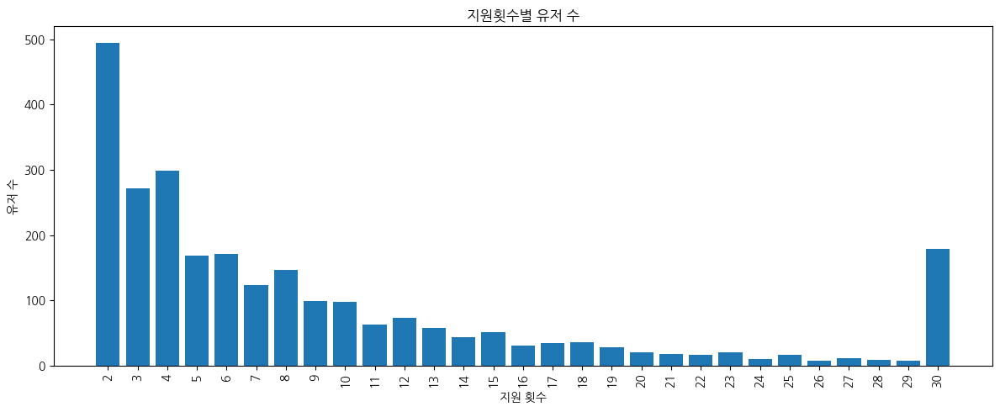
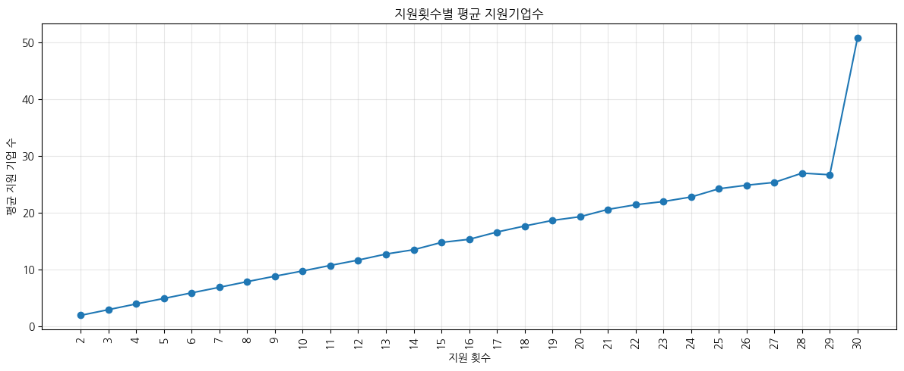
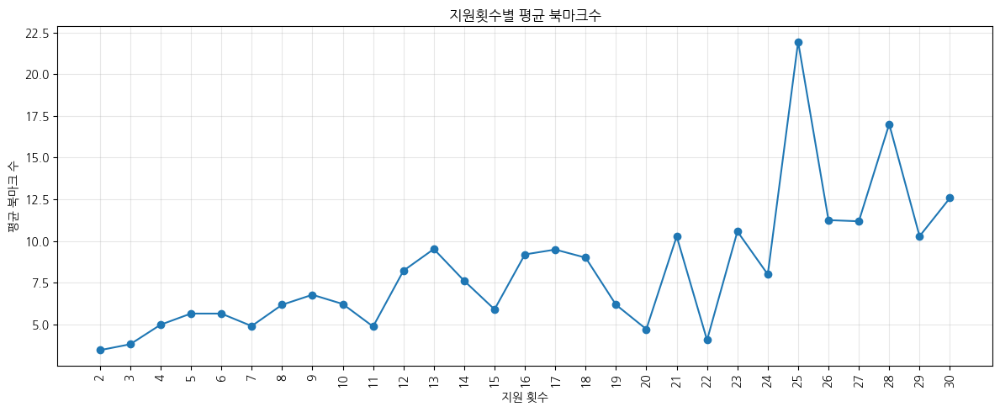
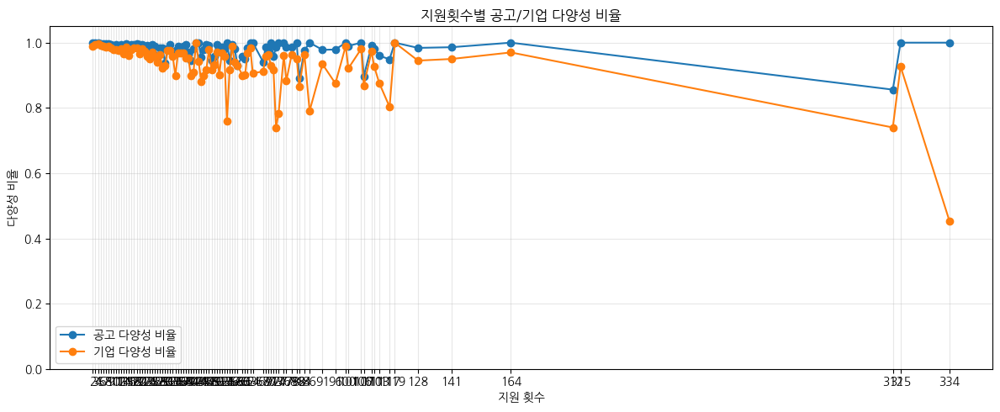

# 다회 지원자 세그먼트 특성 분석 보고서

원본: `notebooks/04_MultiApply_Segment_Analysis.ipynb`

리텐션(재방문)된 유저 중 2회 이상 지원한 "다회 지원자"를 대상으로, 지원 횟수가 늘수록 지원기업수·북마크·지원 다양성이 어떻게 달라지는지 탐색한다. `05_CoreUser_Report.ipynb`의 프로필 강화 분석(11.2절)으로 이어지기 전, 지원 횟수 기준 세그먼트 특성을 먼저 살펴본 사전 탐색 노트북이다.

**분석 대상**: 리텐션 유저 중 지원 횟수 2회 이상. 지원 횟수 1~29회는 개별 구간으로, 30회 이상은 극단치가 통계를 왜곡하지 않도록 하나의 그룹("30")으로 묶어 처리했다.

## 1. 다회 지원자의 규모와 분포

<figure>

<figcaption><b>그림 1.</b> 지원 횟수 구간별 유저 수(30회 이상은 하나의 구간으로 통합). 2회 지원자가 약 495명으로 가장 많고, 이후 완만히 줄어들다가 30회 이상 구간에서 약 180명으로 다시 두드러진다.</figcaption>
</figure>

- 지원 횟수 분포는 **긴 꼬리(long-tail) 형태**다 — 소수 지원(2~4회)에 몰려 있지만, 30회 이상 반복 지원하는 유저층도 무시할 수 없는 규모(약 180명)로 존재한다.

## 2. 지원 횟수가 늘수록 커지는 활동 강도

지원을 많이 할수록 지원 기업 수와 북마크 수도 함께 늘어난다.

<figure>

<figcaption><b>그림 2.</b> 지원 횟수 구간별 평균 지원 기업 수. 2회 지원자는 평균 2개 기업, 30회 이상 구간은 평균 약 51개 기업에 지원한다.</figcaption>
</figure>

<figure>

<figcaption><b>그림 3.</b> 지원 횟수 구간별 평균 북마크 수. 구간별 편차는 있지만(표본이 작아지는 고횟수 구간일수록 변동폭이 커짐), 전반적으로 지원 횟수가 많은 구간일수록 북마크 수도 높은 경향을 보인다.</figcaption>
</figure>

- 지원 기업 수는 지원 횟수와 거의 선형적으로 증가한다 — 지원을 많이 하는 유저는 같은 기업에 반복 지원하는 것이 아니라 그만큼 많은 기업을 접한다.
- 북마크 수도 대체로 함께 증가해, 다회 지원자는 북마크 기능도 더 적극적으로 사용하는 경향을 보인다.

## 3. 지원 다양성 — 반복 지원이 아닌 폭넓은 탐색

지원 공고 수 대비 지원 기업 수의 비율("다양성 비율", 1에 가까울수록 매번 다른 공고·기업에 지원)을 보면, 다회 지원자의 행동 성격이 뚜렷해진다.

<figure>

<figcaption><b>그림 4.</b> 지원 횟수별 공고 다양성 비율(파랑)과 기업 다양성 비율(주황). 대부분 구간에서 두 비율 모두 0.9~1.0 사이에 머문다.</figcaption>
</figure>

- **지원 공고 수와 지원 기업 수가 거의 비례한다** — 지원 10회면 서로 다른 공고 10개, 다른 회사 10곳에 지원했다는 뜻이다. 다회 지원자는 같은 공고를 반복 지원하는 것이 아니라, 다양한 공고와 기업을 적극적으로 탐색하는 유저다.
- 다만 지원 300회를 넘는 극소수 극단치 구간에서는 기업 다양성 비율이 0.45까지 떨어지는 지점이 있다 — 한두 명의 특이 유저가 소수 기업에 반복 지원한 결과로 보이며, 전체 패턴을 뒤집는 수준은 아니다.

## 결론 및 다음 단계

지원 횟수는 단순 반복이 아니라 "플랫폼을 폭넓게 활용하는 정도"를 보여주는 대리 지표(proxy)로 해석할 수 있다. 이 세그먼트 특성(지원 횟수 기준 그룹)은 `05_CoreUser_Report.ipynb`의 여러 절(9. 회사 탐색, 10. 오퍼·사람/네트워크, 11. 프로필 강화)에서 동일한 `apply_count_group` 기준으로 재사용되며, 최종적으로 프로필 강화 행동과 다회 지원 사이의 관계 분석으로 이어진다.
